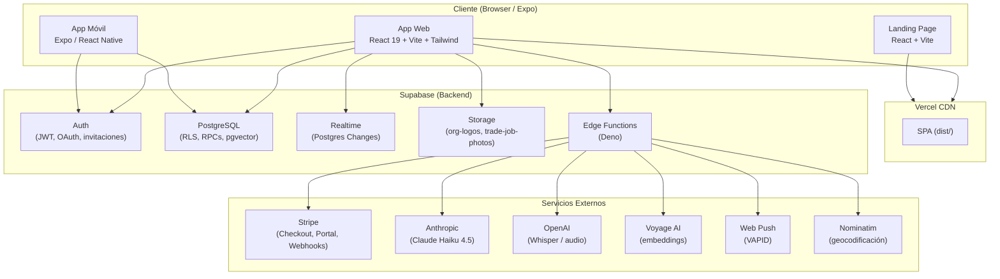
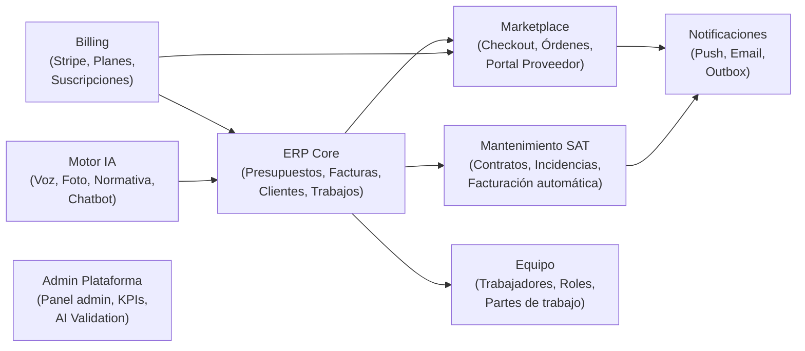
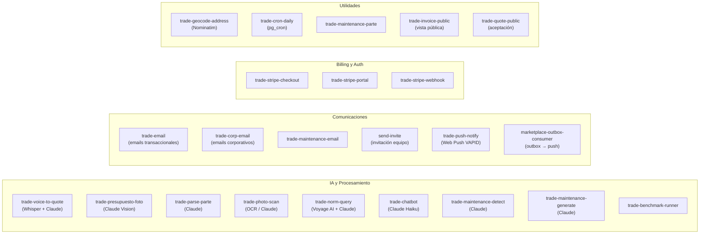
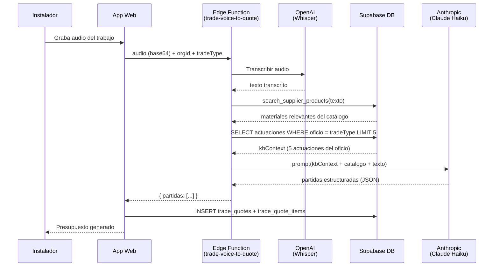
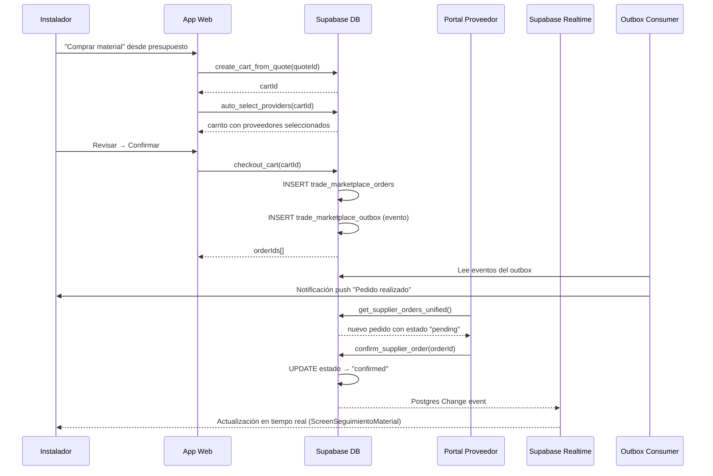
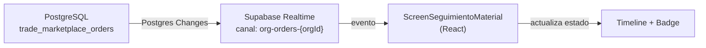

# TrabFlow — System Architecture

**Versión:** 1.0 — Julio 2026  
**Estado:** Normativo. Refleja el estado real del sistema en julio 2026.  
**Propósito:** Mapa completo del sistema: dominios, tablas, servicios, RPCs, Edge Functions, y sus relaciones.

---

## Vista general del sistema



---

## Dominios del sistema

El sistema está organizado en 8 dominios funcionales:



---

## Capa de Frontend

### Estructura de archivos

```
src/
├── App.tsx                          # Routing SPA (ActivePage enum, lazy loading)
├── main.tsx                         # Bootstrap React
├── types.ts                         # Tipos globales (ActivePage, TradeType, interfaces)
├── supabase.gen.ts                  # Tipos generados por Supabase CLI (13.131 líneas)
│
├── components/
│   ├── AppDashboardView.tsx          # Dashboard principal — monolito 10.617 líneas (deuda)
│   ├── AdminView.tsx                 # Panel admin — 3.910 líneas
│   ├── Screen*.tsx                   # Pantallas del ERP y módulos
│   ├── marketplace/                  # Módulo Marketplace (instalador)
│   │   ├── MarketplaceComprarView.tsx
│   │   ├── ScreenSeguimientoMaterial.tsx
│   │   ├── StepRevisar.tsx
│   │   ├── StepConfirmar.tsx
│   │   └── shared/                   # Componentes compartidos
│   │       ├── OrderStatusBadge.tsx
│   │       ├── OrderTimeline.tsx
│   │       └── ConfirmModal.tsx
│   ├── portal/                       # Portal del Proveedor
│   │   ├── PortalProveedorView.tsx
│   │   ├── PortalDashboard.tsx
│   │   ├── PortalPedidos.tsx
│   │   ├── PortalCatalogo.tsx
│   │   ├── PortalEquipo.tsx
│   │   ├── PortalConfiguracion.tsx
│   │   ├── PortalActorSelector.tsx
│   │   └── PortalContext.tsx
│   ├── admin/                        # Subsecciones del Admin
│   │   ├── AdminAIValidationSection.tsx
│   │   ├── AdminDocumentosSection.tsx
│   │   ├── AdminRepositorioSection.tsx
│   │   └── AdminSuppliersSection.tsx
│   ├── auth/                         # Flujo de autenticación
│   ├── landing/                      # Secciones de la landing page
│   ├── partner-demo/                 # Demo guiada para distribuidores
│   ├── demo/                         # Demo interactiva sin login
│   └── ui/                           # Componentes atómicos (Toast, ArticleSearchInput)
│
├── context/
│   └── SessionContext.tsx            # Sesión global: user, org, rol, plan, permisos
│
├── design-system/
│   └── index.ts                      # Tokens DS v1 (botones, inputs, cards, badges...)
│
├── hooks/
│   ├── useClickOutside.ts
│   ├── useIsMobile.ts
│   ├── usePermissions.ts             # can(permiso) basado en rol
│   └── useSubscription.ts            # plan, features, trial, días restantes
│
├── lib/
│   ├── supabase.ts                   # Monolito 3.987 líneas — funciones ERP core
│   ├── client.ts                     # Instancia Supabase para lib/api/
│   ├── api/                          # Capa de acceso a datos por dominio
│   │   ├── marketplace-actors.ts
│   │   ├── marketplace-checkout.ts
│   │   ├── marketplace-orders.ts
│   │   ├── marketplace-portal.ts
│   │   ├── marketplace.ts
│   │   ├── mayoristas.ts
│   │   ├── pedidos.ts
│   │   └── subcontratas.ts
│   ├── exportWord.ts                 # Generación DOCX (presupuestos, contratos)
│   ├── printTradeInvoice.ts          # PDF de facturas
│   ├── routeOptimizer.ts             # Optimización de ruta diaria
│   └── ...                           # Otras utilidades
│
└── pages/
    ├── LandingPage.tsx
    ├── HerramientasView.tsx          # Calculadoras sin login
    ├── ParteView.tsx                 # Vista pública parte de trabajo
    └── ReviewView.tsx                # Valoración pública post-trabajo
```

### Routing

La SPA usa un enum `ActivePage` para el routing. No hay React Router. El cambio de página se hace con `setCurrentPage(ActivePage.X)`.

Las vistas pesadas usan `React.lazy()` para lazy loading:
- `AppDashboardView`
- `AdminView`
- `ScreenWorkerView`
- `DemoView`

### Sistema de roles y permisos

| Rol | Acceso |
|---|---|
| `owner` | Todo |
| `admin` | Todo excepto billing |
| `oficina` | Presupuestos, facturas, clientes, equipo |
| `comercial` | Presupuestos, clientes |
| `tecnico` | Solo ScreenWorkerView (partes, trabajos asignados) |
| `visualizador` | Solo lectura |

---

## Capa de Base de Datos

### Tablas por dominio

#### ERP Core

| Tabla | Propósito |
|---|---|
| `trade_organizations` | Empresa del instalador (org) |
| `trade_org_members` | Usuarios miembros de la org (rol, estado) |
| `trade_workers` | Perfil de trabajador de campo |
| `trade_worker_schedules` | Horarios de trabajadores |
| `trade_clients` | Clientes de la org |
| `trade_quotes` | Presupuestos |
| `trade_quote_items` | Líneas del presupuesto (partidas) |
| `trade_quote_tokens` | Tokens para aceptación pública |
| `trade_jobs` | Trabajos |
| `trade_job_workers` | Técnicos asignados a un trabajo |
| `trade_job_photos` | Fotos del trabajo |
| `trade_job_reviews` | Valoraciones post-trabajo |
| `trade_field_actions` | Partes de trabajo y acciones de campo |
| `trade_invoices` | Facturas |
| `trade_invoice_lines` | Líneas de factura |
| `trade_routes` | Rutas del día |
| `trade_route_stops` | Paradas de una ruta |

#### Catálogo y Material

| Tabla | Propósito |
|---|---|
| `trade_catalog_products` | Catálogo interno de la org |
| `trade_catalog_variants` | Variantes de producto del catálogo |
| `trade_catalog_suggestions` | Sugerencias de catálogo generadas por IA |
| `trade_global_catalog` | Catálogo global de TrabFlow |
| `trade_tarifas` | Tarifas de mano de obra por oficio |
| `trade_supplier_catalogs` | Catálogos de proveedores cargados |
| `trade_supplier_products` | Productos de los catálogos de proveedor |
| `trade_supplier_orders` | Pedidos de material (flujo clásico) |
| `trade_supplier_order_lines` | Líneas de pedido clásico |
| `trade_org_suppliers` | Relación org ↔ proveedor |
| `trade_mayoristas` | Mayoristas / distribuidores |
| `trade_compras` | Compras a mayoristas |

#### Marketplace

| Tabla | Propósito |
|---|---|
| `trade_marketplace_actors` | Empresa proveedora del Marketplace |
| `trade_marketplace_actor_members` | Usuarios del actor (con roles) |
| `trade_marketplace_actor_types` | Tipos de actor (proveedor, fabricante) |
| `trade_marketplace_roles` | Permisos de actor (orders:manage, offerings:write...) |
| `trade_marketplace_invitations` | Invitaciones a unirse como actor |
| `trade_marketplace_universal_products` | Catálogo universal TrabFlow (referencias canónicas) |
| `trade_marketplace_categories` | Categorías del catálogo universal |
| `trade_marketplace_supplier_offerings` | Oferta del proveedor (referencia + precio + stock) |
| `trade_marketplace_supplier_config` | Configuración del proveedor en el Marketplace |
| `trade_marketplace_carts` | Carritos de compra del instalador |
| `trade_marketplace_cart_items` | Líneas del carrito |
| `trade_marketplace_orders` | Pedidos confirmados del Marketplace |
| `trade_marketplace_order_lines` | Líneas del pedido del Marketplace |
| `trade_marketplace_order_events` | Auditoría de cambios de estado del pedido |
| `trade_marketplace_outbox` | Eventos pendientes de procesamiento asíncrono |
| `trade_marketplace_notifications` | Notificaciones del proveedor |
| `trade_marketplace_audit_log` | Log de auditoría general del Marketplace |
| `v_marketplace_invitations_safe` | Vista para invitaciones sin datos sensibles |

#### Mantenimiento SAT

| Tabla | Propósito |
|---|---|
| `trade_maintenance_contratos` | Contratos de mantenimiento |
| `trade_maintenance_incidencias` | Incidencias registradas |
| `trade_maintenance_facturas` | Facturas de mantenimiento |
| `trade_maintenance_modelos` | Modelos de contrato reutilizables |
| `trade_maintenance_oficios` | Oficios cubiertos por contrato |
| `trade_maintenance_plantillas` | Plantillas de contrato |
| `trade_maintenance_presupuestos` | Presupuestos de mantenimiento |
| `trade_maintenance_recargos` | Recargos por festivo, urgencia |
| `trade_maintenance_sectores` | Sectores de actividad del contrato |
| `trade_maintenance_sla` | SLA por tipo de incidencia |

#### Motor IA y Validación

| Tabla | Propósito |
|---|---|
| `trade_actuaciones` | Base de conocimiento de partidas por oficio |
| `trade_ai_feedback` | Feedback explícito de instaladores sobre el motor |
| `trade_ai_versions` | Registro de versiones del motor IA |
| `trade_benchmarks` | Ejecuciones del benchmark oficial |
| `trade_benchmark_queries` | Las 400 queries del benchmark |
| `trade_benchmark_runs` | Runs del benchmark |
| `trade_benchmark_results` | Resultados individuales por query y run |
| `trade_installer_needs` | Preguntas sin responder del chatbot |

#### Billing y Plataforma

| Tabla | Propósito |
|---|---|
| `trade_subscriptions` | Suscripción activa de cada org |
| `trade_waitlist` | Lista de espera (leads) |
| `trade_platform_invoices` | Facturas de la plataforma (admin) |
| `trade_push_subscriptions` | Subscripciones Web Push de cada usuario |
| `trade_client_errors` | Errores de cliente enviados por el logger |
| `trade_documents` | Sistema documental corporativo |
| `trade_contracts` | Contratos firmados (subcontratas, etc.) |
| `trade_subcontratas` | Trabajos externalizados |
| `trade_subcontractors` | Empresas subcontratadas |
| `trade_subcontrata_notas` | Notas de subcontrata |
| `admin_activity_log` | Log de actividad del panel de admin |
| `admin_automation_config` | Configuración de automatizaciones |
| `admin_support_notes` | Notas de soporte al cliente |

#### Storage Buckets

| Bucket | Propósito |
|---|---|
| `org-logos` | Logos de organizaciones |
| `trade-job-photos` | Fotos de trabajos (presupuesto por foto, galería) |

---

## Edge Functions



### Detalle de Edge Functions críticas

#### `trade-voice-to-quote` (Motor IA principal)

```
Input: audio (base64) + orgId + tradeType
  ↓
1. OpenAI Whisper → transcripción de texto
  ↓
2. Búsqueda en trade_actuaciones → kbContext (5 actuaciones)
  ↓
3. Búsqueda en catálogos del proveedor → precios de material
  ↓
4. Claude Haiku 4.5 → extracción de partidas estructuradas
   (max_tokens: 8192, siempre)
  ↓
Output: { partidas: [{descripcion, cantidad, unidad, precio_unitario, ...}] }
```

**Versión actual:** v59 (prompt v59, Edge Function v65)  
**Benchmark:** 98.2% OK rate (400 casos)  
**Latencia P95:** 30.6s (en umbral de alerta)

#### `marketplace-outbox-consumer`

```
Trigger: tras checkout_cart() o pg_cron
  ↓
1. Lee eventos pendientes de trade_marketplace_outbox
  ↓
2. Para cada evento tipo 'order.created':
   - Busca suscripciones push del instalador (trade_push_subscriptions)
   - Envía notificación Web Push (VAPID)
  ↓
3. Marca el evento como procesado
```

#### `trade-norm-query` (Asistente Técnico)

```
Input: pregunta + categoría + orgId
  ↓
1. Verifica límite diario por plan del usuario
  ↓
2. Voyage AI → embedding de la pregunta
  ↓
3. pgvector similarity search → chunks de normativa relevantes
  ↓
4. Claude → respuesta fundamentada en la normativa
  ↓
Output: { respuesta: string, referencias: [{articulo, titulo}] }
```

---

## RPCs (Remote Procedure Calls)

### ERP Core

| RPC | Propósito |
|---|---|
| `seed_org_catalog` | Seed inicial del catálogo al crear org |
| `import_from_global_catalog` | Importar artículos del catálogo global |
| `create_invoice_from_quote` | Crear factura desde presupuesto aceptado |
| `accept_quote` | Aceptar presupuesto via token público |
| `get_parte_info` | Datos del parte de trabajo via token |
| `get_job_review_info` | Datos de la valoración via token |
| `submit_job_review` | Enviar valoración del cliente |
| `invite_member` | Invitar miembro al equipo |

### Motor IA y Catálogo

| RPC | Propósito |
|---|---|
| `search_supplier_products` | Búsqueda semántica en catálogos de proveedor |
| `record_supplier_choice` | Registrar elección de proveedor (aprendizaje) |
| `upsert_partida_aprendida` | Aprendizaje explícito de partidas |
| `update_actuacion_learned` | Actualizar actuación en base de conocimiento |
| `insert_actuacion_learned` | Insertar nueva actuación aprendida |

### Marketplace — Checkout (instalador)

| RPC | Propósito |
|---|---|
| `create_cart_from_quote` | Crear carrito desde presupuesto |
| `create_cart_from_job` | Crear carrito desde trabajo |
| `create_cart_from_field_action` | Crear carrito desde parte de campo |
| `create_cart_from_maintenance_incident` | Crear carrito desde incidencia de mantenimiento |
| `get_cart_detail` | Detalle del carrito con resumen por proveedor |
| `analyze_cart_with_ai` | Análisis IA del carrito |
| `add_cart_item` | Añadir ítem al carrito |
| `select_offering_for_cart_item` | Seleccionar proveedor para un ítem |
| `auto_select_providers` | Auto-seleccionar proveedores para todo el carrito |
| `update_cart_item` | Actualizar ítem del carrito |
| `get_cart_provider_summary` | Resumen de totales por proveedor |
| `checkout_cart` | Confirmar el carrito y crear órdenes |
| `get_cart_order_status` | Estado de las órdenes creadas desde el carrito |
| `list_org_carts` | Listar carritos de la org |

### Marketplace — Órdenes (instalador)

| RPC | Propósito |
|---|---|
| `get_org_active_orders` | Pedidos activos de la org |
| `get_org_order_history` | Historial de pedidos (paginado) |
| `get_order_full_detail` | Detalle completo de un pedido |
| `get_order_events` | Auditoría de eventos de un pedido |
| `prepare_marketplace_order` | Instalador confirma recepción |
| `deliver_marketplace_order` | Marcar pedido como entregado |
| `cancel_marketplace_order` | Cancelar pedido |

### Marketplace — Portal Proveedor

| RPC | Propósito |
|---|---|
| `get_supplier_dashboard_stats` | Stats del dashboard del proveedor |
| `get_supplier_action_center` | Acciones pendientes del proveedor |
| `get_supplier_ai_insights` | Insights IA para el proveedor |
| `get_supplier_health_score` | Health score del proveedor |
| `get_supplier_notifications` | Notificaciones del proveedor |
| `mark_notifications_read` | Marcar notificaciones como leídas |
| `get_supplier_offerings_paged` | Catálogo del proveedor (paginado) |
| `update_supplier_offering` | Actualizar oferta del catálogo |
| `match_offering_to_up` | Vincular offering a producto universal |
| `unmatch_offering` | Desvincular offering |
| `get_offering_match_candidates` | Candidatos de vinculación IA |
| `get_supplier_orders_unified` | Pedidos recibidos del proveedor (unificado legacy + marketplace) |
| `confirm_supplier_order` | Confirmar pedido recibido |
| `ship_supplier_order` | Marcar pedido como enviado (con tracking URL) |
| `create_marketplace_actor` | Crear nuevo actor/proveedor |

### Marketplace — Actores

| RPC | Propósito |
|---|---|
| `get_my_marketplace_memberships` | Membresías del usuario en actores |
| `create_marketplace_invitation` | Invitar a alguien al actor |
| `accept_marketplace_invitation` | Aceptar invitación |
| `transfer_marketplace_ownership` | Transferir ownership del actor |

### Búsqueda Marketplace

| RPC | Propósito |
|---|---|
| `search_marketplace_offerings` | Búsqueda de offerings en el catálogo universal |

### Admin

| RPC | Propósito |
|---|---|
| `admin_get_trade_users` | Listar usuarios de la plataforma |
| `admin_get_platform_invoices` | Facturas de la plataforma |
| `admin_get_waitlist_leads` | Leads de la lista de espera |
| `admin_set_subscription_active` | Activar/suspender suscripción |
| `apply_referral_code` | Aplicar código de referido |
| `apply_scheduled_plan_if_due` | Actualizar plan programado |
| `auto_update_churn_risk` | Calcular riesgo de churn |
| `get_trials_expiring_soon` | Trials que van a expirar |
| `check_email_for_registration` | Verificar si email ya existe |

---

## Flujo de datos — Presupuesto por voz



---

## Flujo de datos — Marketplace Checkout



---

## Flujo de datos — Realtime (instalador)



**Nota:** El proveedor no tiene Realtime activo (ADR-001). Solo el instalador.

---

## Supabase Realtime — Suscripción activa

Solo existe un canal Realtime activo en producción:

| Canal | Tabla | Filtro | Componente |
|---|---|---|---|
| `org-orders-{orgId}` | `trade_marketplace_orders` | `org_id=eq.{orgId}` | `ScreenSeguimientoMaterial.tsx` |

---

## Migraciones en producción

| Migración | Fecha | Qué añade |
|---|---|---|
| `20260623_supplier_orders_rls.sql` | Jun 2026 | RLS en `trade_supplier_orders` |
| `20260624_quote_items_supplier_fields.sql` | Jun 2026 | Columnas proveedor en `trade_quote_items` |
| `20260624_security_hardening.sql` | Jun 2026 | REVOKE EXECUTE en funciones SECURITY DEFINER para `anon` |
| `20260703_ai_validation_center.sql` | Jul 2026 | Tablas del AI Validation Center |
| `20260703_benchmark_runner.sql` | Jul 2026 | Funciones SQL del runner de benchmarks |
| `20260705_ai_versions_release_candidate.sql` | Jul 2026 | Columna `es_release_candidate` en `trade_ai_versions` |
| `20260706_ok_rate_includes_solo_sugeridas.sql` | Jul 2026 | Recomputación de ok_rate incluyendo SOLO_SUGERIDAS |
| `20260724_marketplace_actor_system.sql` | Jul 2026 | Sistema de actores del Marketplace |
| `20260724_marketplace_universal_products.sql` | Jul 2026 | Catálogo universal y categorías |
| `20260724_02_marketplace_actor_hardening.sql` | Jul 2026 | Hardening RLS del sistema de actores |
| `20260724_03_marketplace_portal_schema.sql` | Jul 2026 | Schema del Portal Proveedor |
| `20260724_04_marketplace_checkout_flow.sql` | Jul 2026 | Carrito y checkout |
| `20260724_05_marketplace_order_lifecycle.sql` | Jul 2026 | Ciclo de vida de pedidos + outbox |
| `20260724_06_marketplace_hardening.sql` | Jul 2026 | Hardening final del Marketplace |

---

## Dependencias externas

| Servicio | Uso | Dónde |
|---|---|---|
| Anthropic Claude Haiku 4.5 | Motor IA presupuestos, mantenimiento, chatbot | Edge Functions |
| OpenAI Whisper | Transcripción de audio | `trade-voice-to-quote` |
| Voyage AI | Embeddings de normativa técnica | `trade-norm-query`, scripts de ingesta |
| Stripe | Billing, suscripciones, checkout | `trade-stripe-*` Edge Functions |
| Web Push / VAPID | Notificaciones push | `trade-push-notify`, `marketplace-outbox-consumer` |
| Nominatim | Geocodificación de direcciones | `trade-geocode-address` |

---

## Decisiones arquitecturales documentadas

| ADR | Decisión | Razón |
|---|---|---|
| ADR-001 | Sin Realtime en Portal Proveedor | RPC unificada mezcla legacy/marketplace; `supplier_actor_id` no confirmado en RLS |

---

## Deuda técnica de arquitectura

| Deuda | Descripción | Impacto |
|---|---|---|
| `supabase.gen.ts` desactualizado | No incluye tipos de RPCs del Marketplace — 67 `as any` | Bugs silenciosos en TypeScript |
| Sin staging separado | Toda migración va directo a producción | Alto riesgo en Sprint 2 |
| Sin CI/CD | No hay validación automática antes de despliegue | Regresiones posibles |
| Monolito `AppDashboardView.tsx` | 10.617 líneas — difícil de mantener y testear | Mantenimiento |
| Monolito `src/lib/supabase.ts` | 3.987 líneas — mezcla cliente + lógica de negocio | Mantenimiento |
| App móvil desacoplada | Expo no comparte código con web web | Duplicación de lógica |
